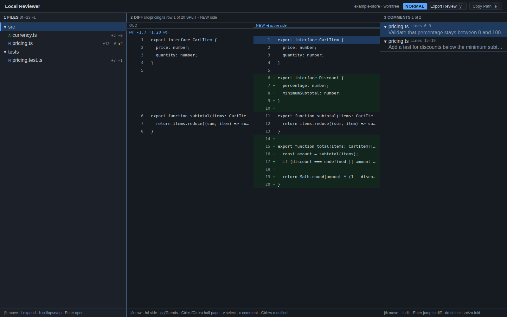

# Local Reviewer

A local, keyboard-first desktop application for reviewing Git changes before
they are committed. Browse the changed-file tree, read a unified or split diff,
attach comments to exact lines, and export the review as Markdown without
modifying the repository.

Local Reviewer is designed for the loop where a coding agent writes code and a
human validates it. The application is deliberately read-only: it never stages,
commits, checks out, or edits the code under review.

## Screenshot



## Features

- Three fixed panels: changed files, diff, and comments.
- Vim-style navigation with normal, visual, and insert modes.
- Unified and side-by-side diffs with syntax highlighting.
- Comments anchored to a file, side, and line range.
- Automatic review persistence between sessions.
- Markdown export that can be handed directly to Codex or another coding agent.
- Worktree, single-commit, and commit-range review scopes.
- Local-only operation with read-only Git commands.

Review state and exported Markdown are stored in `~/.codex/reviews/` by default.
Set `LOCAL_REVIEWER_REVIEWS_DIR` to use another directory.

## Installation

Build the release binary and run the installer:

```sh
npm install
npm run tauri build
./deploy/install.sh
```

The installer copies the application into `~/.local`:

```text
~/.local/bin/reviewer
~/.local/share/applications/reviewer.desktop
~/.local/share/icons/hicolor/128x128/apps/reviewer.png
```

| Option | Description |
| --- | --- |
| `--prefix <dir>` | Install under another prefix instead of `~/.local`. |
| `--dry-run` | Print the planned changes without writing anything. |
| `--help`, `-h` | Show installer help. |

When installing outside `~/.local`, the desktop launcher still works, but the
icon may not be found unless the prefix is included in `XDG_DATA_DIRS`:

```sh
export XDG_DATA_DIRS="<prefix>/share:$XDG_DATA_DIRS"
```

If `~/.local/bin` is not in `PATH`, add it yourself:

```sh
export PATH="$HOME/.local/bin:$PATH"
```

Uninstall with `./deploy/uninstall.sh`. It supports the same `--prefix` and
`--dry-run` options and removes only the launcher, desktop entry, and icon.

## Usage

```text
reviewer [<commit>|<a>..<b>]
  no arguments    review uncommitted changes in the current repository
  <commit>        review one commit
  <a>..<b>        review the accumulated changes in a commit range
  --help, -h      show this help
  outside Git     open the repository picker
```

```sh
cd ~/my-repository
reviewer
reviewer HEAD
reviewer main..HEAD
```

When launched outside a Git repository, Local Reviewer opens a keyboard-driven
picker for recent repositories, directories, and review scopes.

## Keyboard shortcuts

### Global

| Key | Action |
| --- | --- |
| `1` | Focus the file tree. |
| `2` | Focus the diff. |
| `3` | Focus the comments. |
| `Esc` | Leave visual/insert mode or cancel the current action. |
| `y` | Export the review as Markdown. |
| `e` | Copy the exported Markdown path. |

### File tree

| Key | Action |
| --- | --- |
| `j` / `k` | Move down/up. |
| `h` | Collapse a directory or move to its parent. |
| `l` | Expand a directory. |
| `Enter` | Open a file or toggle a directory. |

### Diff

| Key | Action |
| --- | --- |
| `j` / `k` | Move down/up or extend a visual selection. |
| `gg` / `G` | Jump to the first/last line. |
| `Ctrl+d` / `Ctrl+u` | Move half a page down/up. |
| `Ctrl+w v` / `Ctrl+w o` | Open split/unified view. |
| `h` / `l` | Select the old/new side in split view. |
| `Ctrl+w h` / `Ctrl+w l` | Select the old/new side in split view. |
| `v` | Start a visual selection. |
| `c` | Comment on the selected range. |

### Comments

| Key | Action |
| --- | --- |
| `j` / `k` | Move down/up. |
| `gg` / `G` | Jump to the first/last comment. |
| `i` | Edit the selected comment. |
| `Enter` | Open the referenced file and line range. |
| `dd` | Delete the selected comment. |
| `zc` / `zo` | Collapse/expand the selected comment. |
| `Ctrl+Enter` | Save the comment being written. |

### Repository picker

| Key | Action |
| --- | --- |
| `1` / `2` / `3` | Focus recent repositories, browser, or scope. |
| `j` / `k` | Move through the active list. |
| `l` / `h` | Enter a directory / move to its parent. |
| `Enter` | Select the highlighted repository, scope, or commit. |

## Exporting a review

Press `y` to export the current comments to a Markdown file:

```text
~/.codex/reviews/review-2026-07-26.md
```

Press `e` to copy its absolute path, then hand it to Codex:

```text
Apply the corrections in ~/.codex/reviews/review-2026-07-26.md
```

## Development

```sh
npm run tauri dev
npm test
npm run typecheck
cd src-tauri && cargo test
npm run smoke:build
```

## License

Distributed under the [MIT License](LICENSE).
